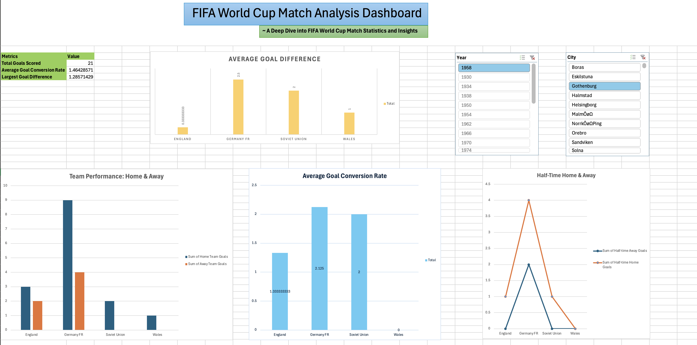

# FIFA World Cup Analysis Dashboards

## Overview

This project showcases interactive Excel dashboards analyzing FIFA World Cup data, focusing on match performance, tournament trends, and team-specific insights.

## Dashboards

### 1. **FIFA World Cup Match Analysis Dashboard**

- **Description**: A dashboard analyzing match-level data including goals scored, goal differences, and conversion rates.
- **Key Features**:
  - Dynamic slicers for filtering by year and city.
  - Summarized key performance metrics such as total goals, average goal conversion rate, and largest goal difference.
  - **Integrated Charts**:
    - _Team Performance: Home & Away Goals_: Bar charts showing home and away goals for each team.
    - _Half-Time Goals vs. Full-Time Goals_: Line charts comparing half-time and full-time goals.
    - _Goal Conversion Rates_: Highlights average conversion rates across teams.

### 2. **FIFA World Cup Tournament Trends Dashboard**

- **Description**: A dashboard exploring tournament-level trends in matches, goals, and attendance over the years.
- **Key Features**:
  - Dynamic slicers for filtering by stadium and referee.
  - Key performance indicators such as total matches, attendance, and goals scored.
  - **Integrated Charts**:
    - _Trends in Matches Played and Attendance_: Line and bar charts visualizing tournament trends.
    - _Goals Distribution by Year_: Pie charts for home and away goals across tournaments.

## Dataset

- **Source**: FIFA World Cup Dataset
- **File**: `FIFA_World_Cup.xlsx`
- **Details**: Includes match, player, and tournament-level data spanning multiple years.

## How to Explore

1. Open the `FIFA_World_Cup.xlsx` file in Microsoft Excel.
2. Navigate through the dashboard sheets:
   - _Match Analysis Dashboard_
   - _Tournament Trends Dashboard_
3. Use slicers to dynamically filter the data by year, city, stadium, or referee.

## Key Highlights

- Modular dashboards with slicers for dynamic interactivity.
- Clear breakdown of match and tournament trends.
- Visual insights into scoring trends and team performance.

---

Feel free to save this content as your README.md for the FIFA World Cup project folder and adjust as needed! Let me know if you’d like assistance in structuring further sections.
